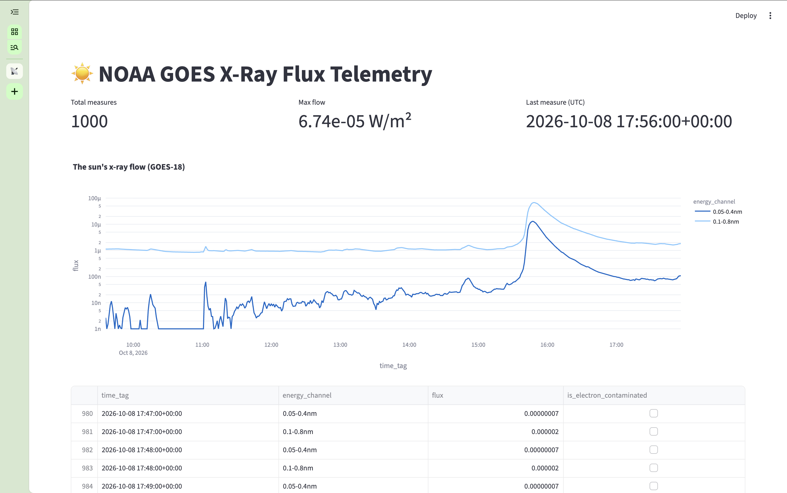

# NOAA Solar X-Ray Telemetry Pipeline & Space Weather DWH


An automated ELT data pipeline and analytical layer modeling a space weather data warehouse (DWH) for solar flare detection, operational radiation monitoring, and satellite telemetry analytics.



-----

## Quickstart (Recommended: Docker)

Spin up the containerized PostgreSQL DWH, provision Airflow metadata storage, and start the scheduled pipeline with a single command:

```bash
# 1. Clone the repository
git clone https://github.com/dannygavrilyak/02_x-ray-radiation-pipeline.git
cd 02_x-ray-radiation-pipeline

# 2. Configure environment
cp .env.example .env

# 3. Build and start services in detached mode
docker compose up -d
```

### Exposed Services & Endpoints

* **PostgreSQL DWH:** `localhost:5435` (Database: `goes_xray_radiation_dwh`, User: `postgres`)
* **Apache Airflow:** `localhost:8080` (Credentials: `airflow` / `airflow`)
* **Streamlit Dashboard:** `localhost:8501` (Run locally via `streamlit run applit.py`)

---

## Architecture & Data Flow

* **Ingestion Layer (`/src` & `/dags`)**: Automated Airflow TaskFlow DAG (`noaa_goes_xray_pipeline`) pulling 6-hour rolling telemetry JSON from the NOAA Space Weather Prediction Center (SWPC) REST API. Handles schema validation and idempotent batch upserts into `public.raw_xray_telemetry` via `ON CONFLICT (time_tag, energy) DO NOTHING`.
* **Transformation Layer (`/dbt_transforms`)**:
  * `models/staging/stg_xray_telemetry.sql`: Staging view standardizing raw telemetry attributes, timestamps, and sensor flags.
  * `models/marts/dim_satellite.sql`: Satellite dimension table with deterministic surrogate key hashing (`MD5(satellite_id)`), business keys, and telemetry metadata.
  * `models/marts/fct_xray_telemetry.sql`: Production fact table joining satellite dimensions, capturing energy bands as degenerate dimensions, physical flux metrics, electron noise flags, and observation timestamps.
* **Reporting Layer (Streamlit & Plotly)**: Real-time operational dashboard (`applit.py`) querying the curated `fct_xray_telemetry` mart, plotting dual-channel irradiance on a logarithmic scale with 65-second caching.

> **Note on data flow:** Data is ingested as an append-only time series. The reporting layer isolates the most recent 1,000 observations via subquery ordering (`ORDER BY time_tag DESC LIMIT 1000`) before rendering chronologically (`ASC`), preventing dashboard latency as historical volume scales.

## Tech Stack

* **Database**: PostgreSQL 15 (Containerized via Docker)
* **Orchestration**: Apache Airflow 2.9 (TaskFlow API, LocalExecutor)
* **Data Transformation**: dbt Core 1.12 (`dbt-postgres`)
* **Languages & Libraries**: Python 3.11+, Pandas, SQLAlchemy, psycopg2-binary, Requests
* **CI/CD & Code Quality**: GitHub Actions, Ruff Linter
* **Business Intelligence**: Streamlit, Plotly Express
* **Environment & Tooling**: Docker Compose, Virtualenv, Git (Conventional Commits)

---

## Streamlit Dashboard & Solar Flare Insights

### Core Physical Metric & Flare Classification

Solar flare severity is classified by peak X-ray flux in the $0.1\text{–}0.8\text{ nm}$ long channel:

```python
# Flare classification thresholds (W/m²)
B_CLASS = flux < 1e-6
C_CLASS = 1e-6 <= flux < 1e-5
M_CLASS = 1e-5 <= flux < 1e-4  # Medium flare (radio blackouts)
X_CLASS = flux >= 1e-4          # Major geomagnetic storm event
```

### Key Telemetry Insights

* **Flare Detection:** On October 8, 2026 at ~15:45 UTC, the pipeline recorded an **M-class solar flare** peaking at $6.74 \times 10^{-5}\text{ W/m}^2$, exhibiting a rapid two-order-of-magnitude flux surge across both spectral channels (`0.05-0.4nm` and `0.1-0.8nm`).
* **Logarithmic Scaling:** Because solar radiation varies from $10^{-9}$ to $10^{-3}\text{ W/m}^2$, linear rendering collapses quiet-sun baselines to zero; logarithmic scaling ($Y$-axis log) is mathematically required to separate background noise from flare onset.

---

## Analytical Marts & Quality Tests

Validate pipeline data contracts and schema assertions via dbt:

* `dbt test --select "dim_satellite"`: Primary key uniqueness and non-null constraints on the satellite dimension.
* `dbt test --select "fct_xray_telemetry"`: Fact grain integrity, referential foreign key checks, and accepted energy range validation.
* `dbt test --select "assert_flux_is_positive"`: Singular assertion verifying non-negative irradiance ($\text{flux} \ge 0$) to catch detector calibration faults.
